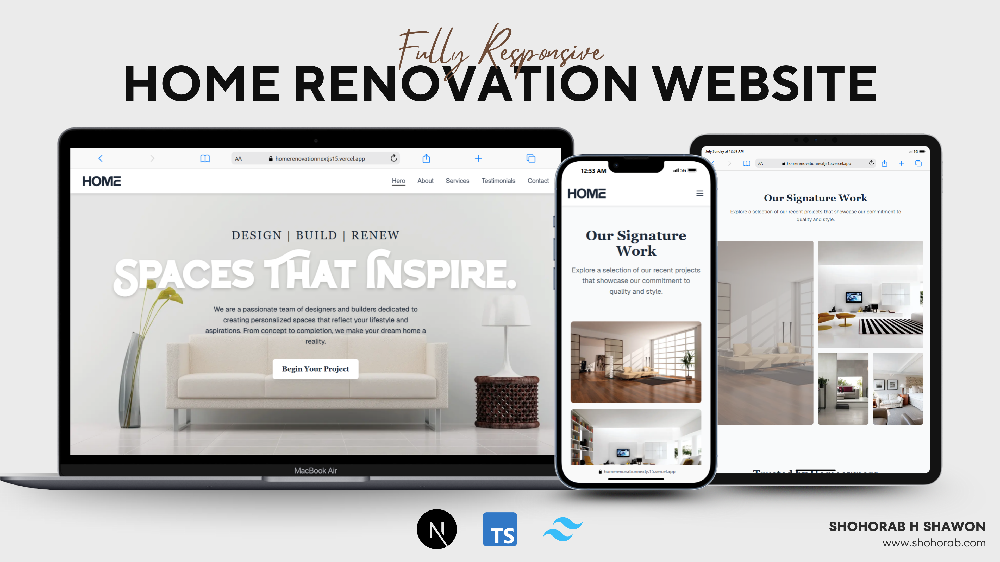

# 🏡 Home Renovation Landing Page



Welcome to the Home Renovation landing page, built with [Next.js](https://nextjs.org)! This project provides a modern, responsive landing page template for home renovation businesses or services.

## 🚀 Getting Started

To run the project locally:

```bash
npm install
npm run dev
# or
yarn install && yarn dev
# or
pnpm install && pnpm dev
# or
bun install && bun dev
```

Visit [http://localhost:3000](http://localhost:3000) in your browser to view the landing page.

## 🛠️ Project Structure

- `app/page.tsx` — Main landing page component.
- `public/cover.jpg` — Cover image for the landing page.
- `styles/` — Custom styles for the project.
- `components/` — Reusable UI components.

## ✏️ Customization

- **Edit Content:** Update `app/page.tsx` to change text, images, or layout.
- **Change Cover Image:** Replace `public/cover.jpg` with your own image for a personalized look.
- **Styling:** Modify files in the `styles/` directory to adjust the appearance.

## 📚 Learn More

- [Next.js Documentation](https://nextjs.org/docs) — Learn about Next.js features and API.
- [Vercel Deployment Guide](https://nextjs.org/docs/app/building-your-application/deploying) — Deploy your landing page with Vercel.

## 🚢 Deploy

Deploy your landing page instantly with [Vercel](https://vercel.com/new?utm_medium=default-template&filter=next.js&utm_source=create-next-app&utm_campaign=create-next-app-readme).

---

Feel free to contribute or customize this template for your own home renovation business!
